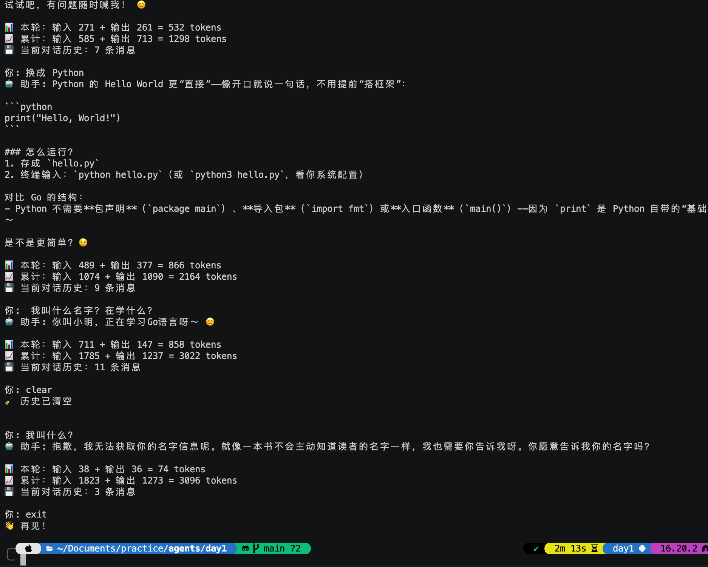

# Day 1 · 环境搭建 + LLM 首次调用 ✅

> 📖 **详细教程**：[docs/day1.html](../docs/day1.html) 或访问 [GitHub Pages 网站](https://gip886.github.io/agents/day1.html)
>
> 本文件是快速参考，方便在写代码时对照。

## 🎯 目标

跑通火山引擎 API，理解 Agent 的"记忆"（messages 数组）。

## 📋 任务清单

- [x] 装依赖：`openai`、`python-dotenv`
- [x] 火山方舟拿到 API Key + Endpoint ID
- [x] 配置 `.env`
- [x] 完成 `demo1_single_chat.py`（单轮对话）
- [x] 完成 `demo2_chat_loop.py`（多轮 + Streaming + Token 统计）
- [x] 验证多轮记忆生效、`clear` 后失忆

## 🖼️ 运行效果



从截图可以看到：
- **多轮记忆生效**：LLM 记得"小明在学 Go"，跨越多轮对话
- **Token 累计**：随着对话变长，`prompt_tokens` 越来越大（这是后续要优化的方向）
- **`clear` 有效**：消息数从 11 降回 3，token 也回落
- **Streaming 输出**：字符逐个吐出，体验流畅

## 🚀 快速开始

```bash
# 1. 激活虚拟环境
cd day1
python3 -m venv venv
source venv/bin/activate

# 2. 装依赖
pip install -r requirements.txt

# 3. 复制 .env 模板并填入你的 Key
cp .env.example .env
# 用编辑器打开 .env，填入你的 ARK_API_KEY 和 ARK_ENDPOINT_ID

# 4. 跑 demo
python demo1_single_chat.py
python demo2_chat_loop.py
```

## 📁 文件说明

| 文件 | 说明 |
|------|------|
| `.env.example` | 环境变量模板（**会被提交**） |
| `.env` | 你的真实密钥（**被 gitignore 屏蔽**） |
| `requirements.txt` | 依赖列表 |
| `demo1_single_chat.py` | 最简单的单轮对话 |
| `demo2_chat_loop.py` | 多轮对话 + Streaming |

## 🧠 核心概念（30 秒版）

- **messages 数组**：Agent 的记忆载体，`[{role, content}, ...]`
- **system prompt**：LLM 的身份设定，放第一条
- **stream=True**：流式返回，改善体验
- **endpoint_id**：火山方舟特色，不是模型名

## ✅ 完成后

```bash
git add day1/
git commit -m "Day 1: 环境搭建 + LLM 首次调用"
git push
```

**先 `git status` 确认 `.env` 没被追踪！**
