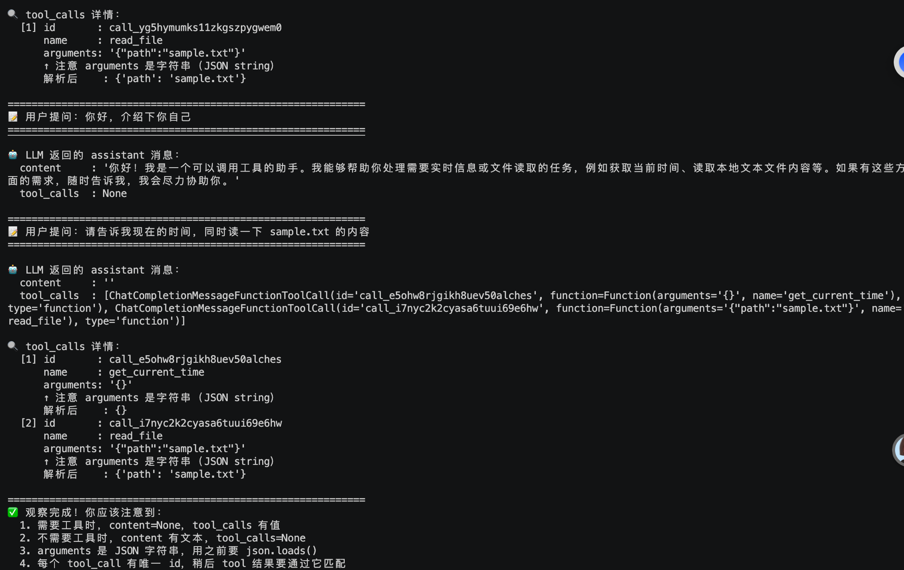
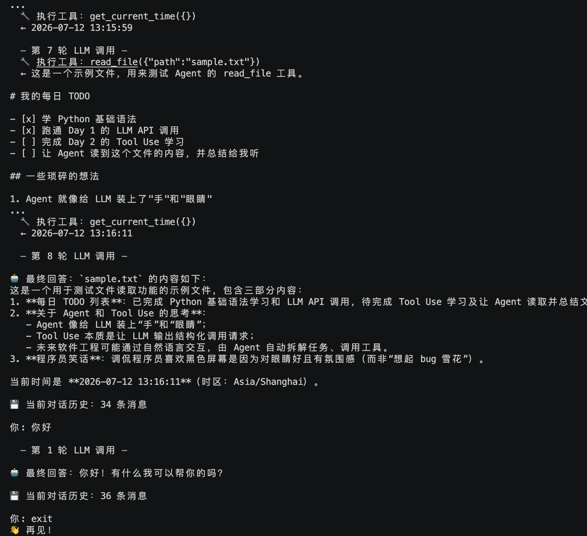

# Day 2 · Tool Use（工具调用） ✅

> 📖 **详细教程**：[docs/day2.html](../docs/day2.html) 或访问 [GitHub Pages 网站](https://gip886.github.io/agents/day2.html)

## 🎯 目标

让 LLM 学会**调用你写的函数**，理解 `tool_calls` → `tool_result` 循环。

## 📋 任务清单

- [x] 跑 `demo1_tool_basics.py`，看清楚 tool_calls 长啥样
- [x] 跑 `demo2_agent_loop.py`，实现完整的 Agent 循环
- [x] 测试单工具、多工具、无工具三种场景
- [x] 观察到 LLM 一次可以返回**多个** tool_calls（并行调用）

## 🖼️ 运行效果

### Demo 1 · 观察 tool_calls 结构


**观察到的现象**：
- 问"现在几点" → `content=None`，`tool_calls` 有 `get_current_time`
- 问"介绍自己" → 正常文本回答，无 tool_calls
- 问"告诉我时间同时读文件" → **一次返回 2 个 tool_calls**（并行）

### Demo 2 · 完整 Agent Loop


**观察到的现象**：
- 需要工具的问题：8 轮 LLM 调用，累计 34 条消息
- "你好"这种简单问题：1 轮就完成，无 tool_call
- Agent 能自主决定何时调用工具、调用哪些工具

## 🚀 快速开始

```bash
cd day2

# 建虚拟环境
python3 -m venv venv
source venv/bin/activate

# 装依赖
pip install -r requirements.txt

# 复用 Day 1 的 .env，或者复制一份过来
cp ../day1/.env .env

# 跑 demo 1：先看清楚 tool_calls 长啥样
python demo1_tool_basics.py

# 跑 demo 2：完整的 Agent
python demo2_agent_loop.py
```

## 📁 文件说明

| 文件 | 说明 |
|------|------|
| `demo1_tool_basics.py` | 观察 LLM 怎么"决定用工具"，不实际执行 |
| `demo2_agent_loop.py` | 完整 Agent 循环：定义工具 + 执行 + 结果回传 |
| `sample.txt` | 用来给 Agent 读的示例文件 |
| `.env.example` | 环境变量模板 |

## 🧠 核心概念（30 秒版）

### 4 种消息角色
- `system` - 身份设定（你写）
- `user` - 用户提问（用户输入）
- `assistant` - LLM 回复；**可以是文本，也可以是 tool_calls**
- `tool` - 工具执行结果（你写代码回传给 LLM）

### 一次完整调用的消息流
```
user → assistant(tool_calls) → tool(result) → assistant(content)
```

### Agent 心脏（伪代码）
```python
while True:
    msg = llm(messages, tools=tools)
    messages.append(msg)           # ⚠️ 必须加，包括 tool_calls
    if not msg.tool_calls:
        return msg.content
    for tc in msg.tool_calls:
        result = execute(tc.function.name, tc.function.arguments)
        messages.append({"role": "tool", "tool_call_id": tc.id, "content": result})
```

## ⚠️ 三个必错的点

1. 忘了把 `assistant`（含 tool_calls）加进 messages → LLM 会"失忆"
2. `arguments` 是 JSON 字符串，不是 dict → 用前 `json.loads()`
3. `tool` 消息必须带 `tool_call_id` → 否则 API 报 400

## ✅ 完成后

```bash
git add day2/
git commit -m "Day 2: Tool Use 工具调用"
git push
```
