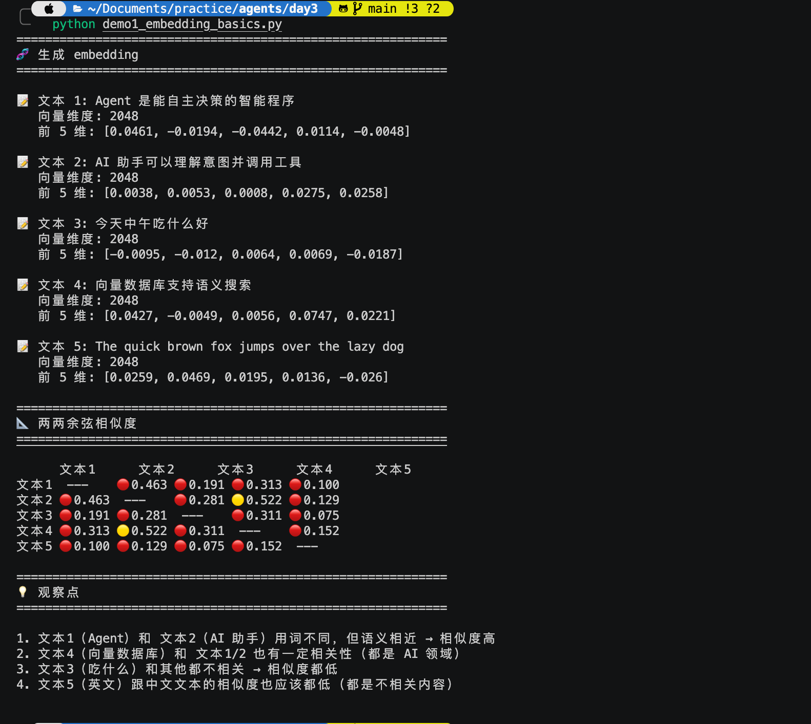
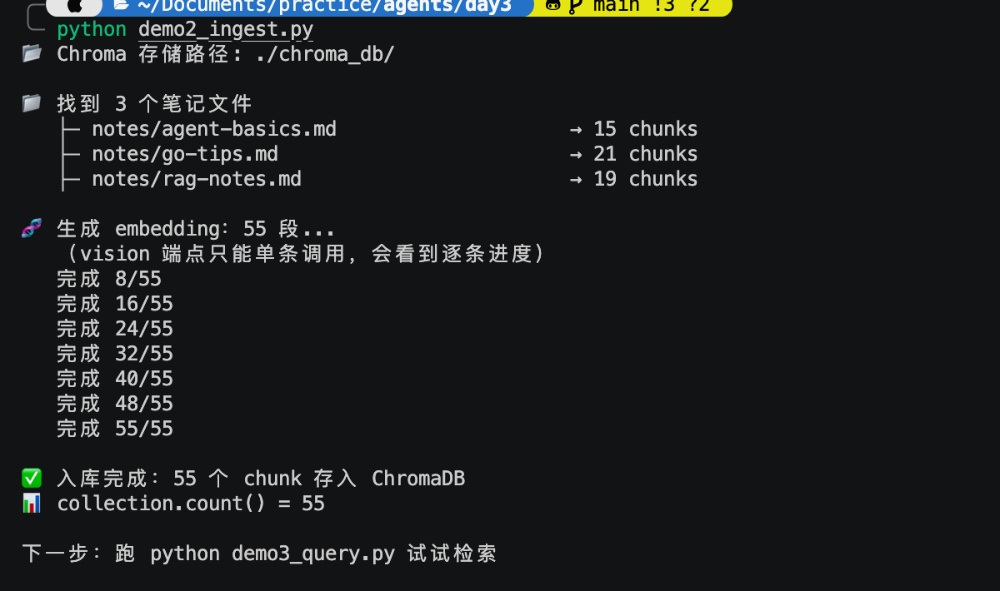
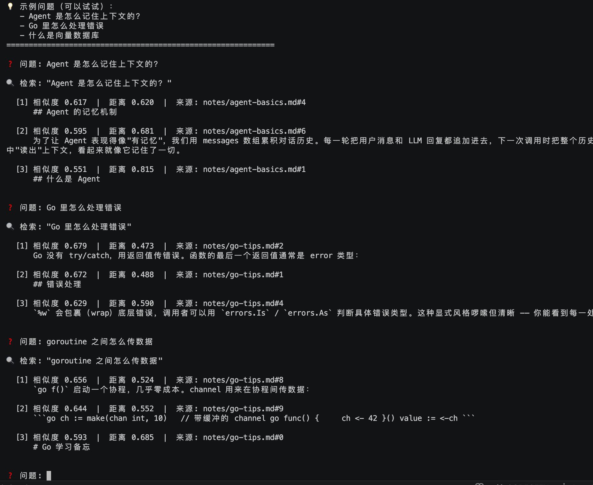

# Day 3 · RAG 向量检索 ✅

> 📖 **详细教程**：[docs/day3.html](../docs/day3.html) 或访问 [GitHub Pages 网站](https://gip886.github.io/agents/day3.html)

## 🎯 目标

让 Agent 能"读懂"你的笔记 —— 知识助手项目的心脏。

## 📋 任务清单

- [x] 装依赖：`chromadb` + `httpx`
- [x] 火山方舟开通 Embedding 接入点（Doubao-embedding-vision）
- [x] 更新 `.env`，加上 `ARK_EMBEDDING_ENDPOINT_ID`
- [x] 跑 `demo1_embedding_basics.py`（感受向量相似度）
- [x] 跑 `demo2_ingest.py`（入库 55 chunks）
- [x] 跑 `demo3_query.py`（语义检索）
- [x] 验证语义搜索：关键词不匹配的问题也能找到相关内容

## 🖼️ 运行效果

### Demo 1 · 余弦相似度矩阵


- 文本 2（AI 助手）vs 文本 4（向量数据库）：**0.522** 🟡 (都是 AI 领域)
- 文本 1（Agent）vs 文本 2（AI 助手）：**0.463** 🔴 (略低于预期，但仍是最高的一组)
- 吃什么 vs 其他所有：**都低** ✅

### Demo 2 · Ingest 流水线


3 篇笔记 → 55 个 chunk → ChromaDB。vision endpoint 单条调用，55 条约耗时半分钟。

### Demo 3 · 语义检索


**关键成就**：
- 问"Agent 是怎么记住上下文的？" → 命中 `agent-basics.md#4` (记忆机制段)，相似度 **0.617**
- 问"Go 里怎么处理错误" → 精准命中 `go-tips.md#2` (错误处理段)，相似度 **0.679**
- 问"goroutine 之间怎么传数据" → 命中 channel 相关段落 —— 关键词完全不匹配也找到了！

## 🚀 快速开始

```bash
cd day3

python3 -m venv venv
source venv/bin/activate
pip install -r requirements.txt

# 从 day2 复制 .env，然后补充 Embedding 端点
cp ../day2/.env .env
# 手动加一行：ARK_EMBEDDING_ENDPOINT_ID=ep-xxxxx

# 依次跑
python demo1_embedding_basics.py   # 感受相似度
python demo2_ingest.py             # 建库
python demo3_query.py              # 检索
```

## 📁 文件说明

| 文件 | 说明 |
|------|------|
| `demo1_embedding_basics.py` | 玩玩 embedding，看两两相似度 |
| `demo2_ingest.py` | 读 notes → chunk → embed → 存 Chroma |
| `demo3_query.py` | 查询 REPL |
| `notes/*.md` | 3 篇示例笔记（Agent、RAG、Go） |
| `chroma_db/` | 向量库数据（自动生成，gitignore 屏蔽） |

## 🧠 核心概念（30 秒版）

- **embedding**：文本 → 浮点数组，语义相近的向量挨得近
- **cosine similarity**：衡量向量"多相似"，范围 [-1, 1]，越大越像
- **chunking**：长文档要切成小块（~500 字），才好检索
- **ChromaDB**：本地向量库，`PersistentClient(path=...)` 就能用
- **两阶段**：Ingest（建库，一次性）+ Query（每次查询）

## ⚠️ 三个必知的点

1. **入库和查询必须用同一个 embedding 模型**，否则向量不在一个空间
2. 我们自己算好向量传给 Chroma，**不要用它内置的 embedding**（会尝试联网下模型）
3. Chroma 用**距离**（越小越像），不是相似度；我们代码里做了 `1/(1+dist)` 转换

## ✅ 完成后

```bash
git add day3/
git commit -m "Day 3: RAG 向量检索"
git push
```
